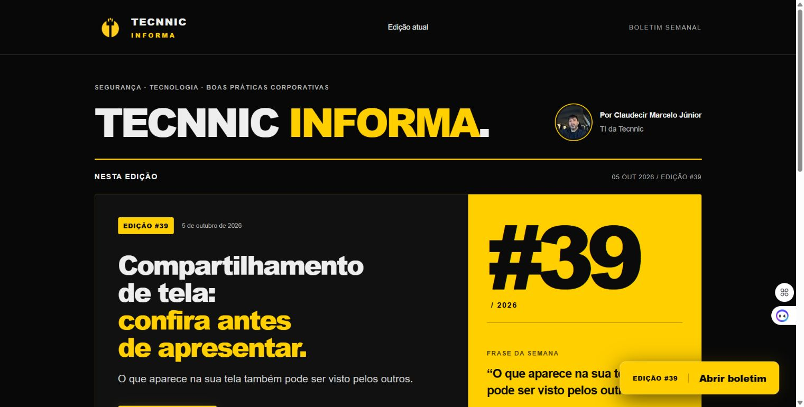

  <picture>
    <source media="(prefers-reduced-motion: reduce)" srcset="assets/banner-cronos23-v2.jpg" />
    
  </picture>

# Claudecir Marcelo Junior

**Cronos23** · Meu codinome em projetos de tecnologia.

**TI, redes e automação aplicadas a problemas reais.**

Meu foco é simplificar rotinas, organizar informações e desenvolver soluções úteis. Tenho interesse em infraestrutura, segurança defensiva e desenvolvimento de ferramentas que tornem a tecnologia mais acessível no dia a dia.

Tenho 8 anos de experiência em telecomunicações, com atuação em redes, telefonia e internet.

## Meu site · Cronos23

[**Acesse meu portfólio profissional →**](https://cronos23-portfolio.jrmarcelo23.chatgpt.site/)

Conheça minha atuação em TI, infraestrutura, dados, segurança eletrônica e automação de ambientes, além dos projetos apresentados e canais de contato.

## Áreas de atuação e interesse

| Área | Foco |
| :--- | :--- |
| Infraestrutura e redes | Diagnóstico, disponibilidade e organização de ambientes. |
| Automação | Scripts e ferramentas para reduzir tarefas repetitivas. |
| Desenvolvimento | Interfaces, aplicações e utilitários com uso prático. |
| Segurança defensiva | Boas práticas, prevenção e análise responsável. |
| Documentação | Instruções claras, processos organizados e manutenção mais simples. |

## Como conduzo meus projetos

- Entender o problema antes de escolher a ferramenta.
- Priorizar clareza, usabilidade e manutenção.
- Validar o que foi implementado e documentar suas limitações.
- Compartilhar apenas conteúdo adequado à divulgação pública.

## Projeto em destaque

### Tecnnic Informa

**Comunicação sobre segurança, tecnologia e boas práticas corporativas.**

Boletim semanal com orientações práticas para tornar o uso da tecnologia mais consciente no dia a dia. O portal apresenta a edição atual e oferece acesso direto ao boletim.

**Minha participação:** publicação do boletim e organização da apresentação digital do conteúdo.

**Tecnologias do projeto:** HTML, CSS, JavaScript, Node.js, GitHub e Canva.

| Aspecto | Aplicação no projeto |
| :--- | :--- |
| Comunicação | Orientações objetivas sobre segurança e uso da tecnologia. |
| Experiência de uso | Edição atual em destaque e acesso direto ao boletim. |
| Identidade visual | Apresentação consistente com a identidade da publicação. |

[**Conheça o Tecnnic Informa →**](https://tecnnic-informa.jrmarcelo23.chatgpt.site/) · [**Veja a apresentação do projeto**](projetos/tecnnic-informa.md)

## Contato

- **E-mail:** [clashcronos23@gmail.com](mailto:clashcronos23@gmail.com)
- **Telefone / WhatsApp:** [+55 (48) 99902-2204](https://wa.me/5548999022204)

## Por aqui

Este espaço reúne meus interesses técnicos e minha evolução em projetos pessoais. Novos trabalhos públicos serão apresentados com contexto, documentação e instruções de uso.

[Organização dos projetos pessoais](docs/ORGANIZACAO-GITHUB.md) · [Modelo para novos projetos](modelos/projeto-pessoal/README.md)

---

Aprender, construir e melhorar — um projeto por vez.

