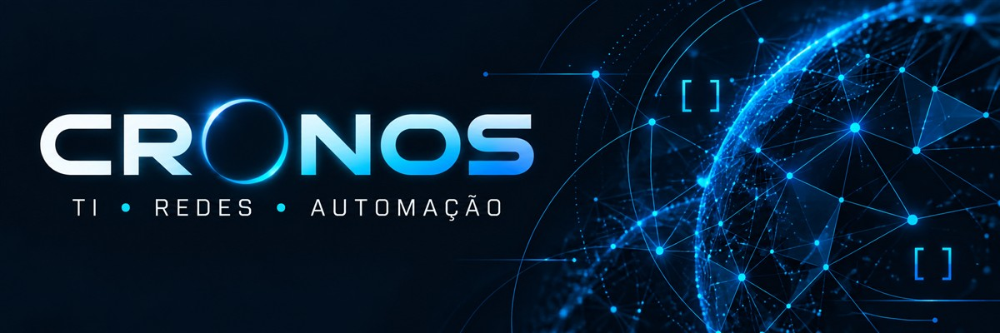

  

# Olá, eu sou o Cronos

**TI, redes e automação aplicadas a problemas reais.**

Meu foco é simplificar rotinas, organizar informações e desenvolver soluções úteis. Tenho interesse em infraestrutura, segurança defensiva e desenvolvimento de ferramentas que tornem a tecnologia mais acessível no dia a dia.

## Áreas de interesse

| Área | Foco |
| :--- | :--- |
| Infraestrutura e redes | Diagnóstico, disponibilidade e organização de ambientes. |
| Automação | Scripts e ferramentas para reduzir tarefas repetitivas. |
| Desenvolvimento | Interfaces, aplicações e utilitários com uso prático. |
| Segurança defensiva | Boas práticas, prevenção e análise responsável. |
| Documentação | Instruções claras, processos organizados e manutenção mais simples. |

## Como conduzo meus projetos

- Entender o problema antes de escolher a ferramenta.
- Priorizar clareza, usabilidade e manutenção.
- Validar o que foi implementado e documentar suas limitações.
- Compartilhar apenas conteúdo adequado à divulgação pública.

## Por aqui

Este espaço reúne meus interesses técnicos e minha evolução em projetos pessoais. Novos trabalhos públicos serão apresentados com contexto, documentação e instruções de uso.

---

Aprender, construir e melhorar — um projeto por vez.

