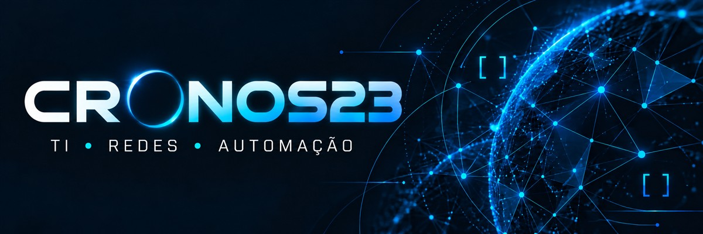

  

# Claudecir Marcelo Junior

**Cronos23** · Meu codinome em projetos de tecnologia.

**TI, redes e automação aplicadas a problemas reais.**

Meu foco é simplificar rotinas, organizar informações e desenvolver soluções úteis. Tenho interesse em infraestrutura, segurança defensiva e desenvolvimento de ferramentas que tornem a tecnologia mais acessível no dia a dia.

## Áreas de interesse

| Área | Foco |
| :--- | :--- |
| Infraestrutura e redes | Diagnóstico, disponibilidade e organização de ambientes. |
| Automação | Scripts e ferramentas para reduzir tarefas repetitivas. |
| Desenvolvimento | Interfaces, aplicações e utilitários com uso prático. |
| Segurança defensiva | Boas práticas, prevenção e análise responsável. |
| Documentação | Instruções claras, processos organizados e manutenção mais simples. |

## Como conduzo meus projetos

- Entender o problema antes de escolher a ferramenta.
- Priorizar clareza, usabilidade e manutenção.
- Validar o que foi implementado e documentar suas limitações.
- Compartilhar apenas conteúdo adequado à divulgação pública.

## Projeto em destaque

### Tecnnic Informa

**Comunicação sobre segurança, tecnologia e boas práticas corporativas.**

Boletim semanal com orientações práticas para tornar o uso da tecnologia mais consciente no dia a dia. O portal apresenta a edição atual e oferece acesso direto ao boletim.

**Minha participação:** publicação do boletim e organização da apresentação digital do conteúdo.

| Aspecto | Aplicação no projeto |
| :--- | :--- |
| Comunicação | Orientações objetivas sobre segurança e uso da tecnologia. |
| Experiência de uso | Edição atual em destaque e acesso direto ao boletim. |
| Identidade visual | Apresentação consistente com a identidade da publicação. |

[**Conheça o Tecnnic Informa →**](https://tecnnic-informa.jrmarcelo23.chatgpt.site/)

## Por aqui

Este espaço reúne meus interesses técnicos e minha evolução em projetos pessoais. Novos trabalhos públicos serão apresentados com contexto, documentação e instruções de uso.

---

Aprender, construir e melhorar — um projeto por vez.

